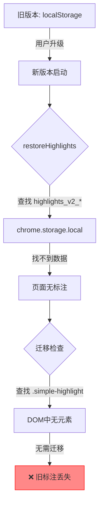
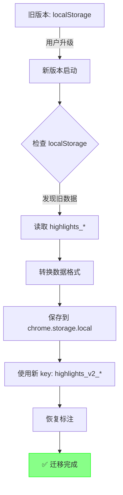

# 标注迁移问题分析与解决方案

## 📋 问题描述

**用户反馈：**
> "之前的一次版本升級，改變了標註功能的底層架構，為此也添加了一個舊標準數據轉移到新架構下的功能，現在發現並沒有轉移，升級到新版後，舊版標註狀態就消失了"

## 🔍 问题根源分析

### 1. 架构变化回顾

**旧版本（v2.4.x 及之前）：**
- 使用 DOM 直接修改方式
- 标注方式：在页面中插入 `<span class="simple-highlight">` 元素
- 存储格式：保存在 `localStorage`，key 为 `highlights_<url>`
- 数据结构：简单的数组，包含文本和颜色信息

**新版本（v2.5.x+）：**
- 使用 CSS Custom Highlight API
- 标注方式：不修改 DOM，使用浏览器原生 API
- 存储格式：保存在 `chrome.storage.local`，key 为 `highlights_v2_<normalized_url>`
- 数据结构：包含完整的 Range 序列化信息（startContainerPath, endContainerPath 等）

### 2. 迁移机制现状

项目中有 **两套迁移系统**：

#### A. `highlighter-migration.js` - 手动确认迁移
- 查找页面中的 `.simple-highlight` span 元素
- 弹出对话框让用户选择是否迁移
- **问题：** 需要 **DOM 中已经有旧标注元素**

#### B. `seamless-migration.js` - 无痛自动迁移
- 3 阶段迁移流程
- **问题：** 同样依赖 **DOM 中的旧标注元素**

#### C. `background.js` - localStorage 迁移
- 函数：`migrateLegacyHighlights()`
- 从 `localStorage` 读取旧标注数据
- 保存到 `chrome.storage.local`
- **问题：** 只迁移数据，不处理格式转换

### 3. 核心问题

**关键发现：所有迁移方案都假设旧标注已经被恢复到 DOM 中！**

```javascript
// seamless-migration.js line 118
const oldSpans = document.querySelectorAll('.simple-highlight');
```

**实际情况：**
1. 用户升级到新版本
2. 打开已有标注的页面
3. 新版代码尝试恢复标注：
   - `restoreHighlights()` 使用新格式 key：`highlights_v2_<url>`
   - 在 `chrome.storage.local` 中找不到（因为旧数据在 `localStorage`，且 key 不同）
   - 无法恢复任何标注
4. 迁移代码检查：
   - `document.querySelectorAll('.simple-highlight')` 找不到（因为没有恢复）
   - 认为"无需迁移"
   - **结果：旧标注永久丢失！**

### 4. 数据迁移链路断裂



正确的迁移链路应该是：



## 🎯 解决方案

### 方案 1: 修复现有迁移逻辑（推荐）

#### 步骤：

1. **在 `highlighter-v2.js` 初始化时，先检查 localStorage**

```javascript
constructor() {
    // ... 现有代码 ...
    
    // 🔧 修复：优先检查并迁移 localStorage 数据
    this.checkAndMigrateLegacyData();
    
    // 从存储恢复标注
    this.restoreHighlights();
    
    // 检查并执行无痛自动迁移（处理 DOM 中的旧 span）
    this.performSeamlessMigration();
}
```

2. **添加新方法：`checkAndMigrateLegacyData()`**

```javascript
/**
 * 检查并迁移 localStorage 中的旧标注数据
 */
async checkAndMigrateLegacyData() {
    console.log('🔍 [迁移] 检查 localStorage 中的旧标注数据...');
    
    try {
        const currentUrl = window.location.href;
        const normalizedUrl = normalizeUrl(currentUrl);
        
        // 检查可能的旧 key
        const possibleKeys = [
            `highlights_${normalizedUrl}`,
            `highlights_${currentUrl}`,
            'highlights_' + window.location.pathname
        ];
        
        let legacyData = null;
        let foundKey = null;
        
        // 尝试所有可能的 key
        for (const key of possibleKeys) {
            const raw = localStorage.getItem(key);
            if (raw) {
                try {
                    const data = JSON.parse(raw);
                    if (Array.isArray(data) && data.length > 0) {
                        legacyData = data;
                        foundKey = key;
                        console.log(`✅ 发现旧标注数据: ${key}, ${data.length} 个标注`);
                        break;
                    }
                } catch (e) {
                    console.warn(`解析失败: ${key}`, e);
                }
            }
        }
        
        // 如果没找到，遍历所有 localStorage
        if (!legacyData) {
            for (let i = 0; i < localStorage.length; i++) {
                const key = localStorage.key(i);
                if (key && key.startsWith('highlights_')) {
                    const raw = localStorage.getItem(key);
                    try {
                        const data = JSON.parse(raw);
                        if (Array.isArray(data) && data.length > 0) {
                            legacyData = data;
                            foundKey = key;
                            console.log(`✅ 发现旧标注数据: ${key}, ${data.length} 个标注`);
                            break;
                        }
                    } catch (e) {
                        // 忽略解析错误
                    }
                }
            }
        }
        
        if (legacyData && foundKey) {
            // 执行数据迁移
            await this.migrateLegacyDataToNewFormat(legacyData, foundKey);
        } else {
            console.log('ℹ️ 未发现需要迁移的旧标注数据');
        }
    } catch (error) {
        console.error('❌ 检查旧数据失败:', error);
    }
}

/**
 * 将旧格式数据迁移到新格式
 */
async migrateLegacyDataToNewFormat(legacyData, oldKey) {
    console.log(`🔄 [迁移] 开始迁移 ${legacyData.length} 个旧标注...`);
    
    try {
        const migratedHighlights = [];
        
        for (const oldItem of legacyData) {
            // 旧格式可能是：
            // { text: "...", color: "yellow", ... }
            // 或简单的字符串
            
            if (typeof oldItem === 'object' && oldItem.text) {
                // 尝试在页面中找到这段文本
                const textToFind = oldItem.text;
                const color = oldItem.color || 'yellow';
                
                // 使用文本搜索算法查找
                const range = this.findTextInPage(textToFind);
                
                if (range) {
                    const newId = `highlight-${this.nextId++}`;
                    const rangeInfo = this.serializeRange(range);
                    
                    migratedHighlights.push({
                        id: newId,
                        color: color,
                        text: textToFind,
                        timestamp: oldItem.timestamp || Date.now(),
                        rangeInfo: rangeInfo
                    });
                    
                    console.log(`  ✅ 成功迁移: ${textToFind.substring(0, 30)}...`);
                } else {
                    console.warn(`  ⚠️ 无法定位文本: ${textToFind.substring(0, 30)}...`);
                }
            }
        }
        
        if (migratedHighlights.length > 0) {
            // 保存到新存储
            const currentUrl = window.location.href;
            await StorageUtil.saveHighlights(currentUrl, {
                url: currentUrl,
                highlights: migratedHighlights
            });
            
            // 删除旧数据
            localStorage.removeItem(oldKey);
            
            console.log(`✅ [迁移] 成功迁移 ${migratedHighlights.length}/${legacyData.length} 个标注`);
            console.log(`🗑️ [迁移] 已删除旧数据: ${oldKey}`);
            
            // 标记迁移完成
            await chrome.storage.local.set({
                [`migration_completed_${window.location.href}`]: {
                    timestamp: Date.now(),
                    oldKey: oldKey,
                    migratedCount: migratedHighlights.length,
                    totalCount: legacyData.length
                }
            });
        }
    } catch (error) {
        console.error('❌ [迁移] 数据迁移失败:', error);
    }
}

/**
 * 在页面中查找文本并返回 Range
 */
findTextInPage(textToFind) {
    try {
        // 使用 window.find() API
        const found = window.find(textToFind, false, false, true, false, true, false);
        
        if (found) {
            const selection = window.getSelection();
            if (selection.rangeCount > 0) {
                const range = selection.getRangeAt(0).cloneRange();
                selection.removeAllRanges();
                return range;
            }
        }
        
        // 如果 window.find() 失败，使用 TreeWalker
        return this.findTextWithTreeWalker(textToFind);
    } catch (error) {
        console.error('查找文本失败:', error);
        return null;
    }
}

/**
 * 使用 TreeWalker 查找文本
 */
findTextWithTreeWalker(textToFind) {
    const walker = document.createTreeWalker(
        document.body,
        NodeFilter.SHOW_TEXT,
        null
    );
    
    let node;
    const textNodes = [];
    
    while (node = walker.nextNode()) {
        textNodes.push(node);
    }
    
    // 在文本节点中查找匹配
    for (let i = 0; i < textNodes.length; i++) {
        const node = textNodes[i];
        const text = node.textContent;
        
        if (text.includes(textToFind)) {
            const startOffset = text.indexOf(textToFind);
            const range = document.createRange();
            range.setStart(node, startOffset);
            range.setEnd(node, startOffset + textToFind.length);
            return range;
        }
        
        // 尝试跨节点匹配
        let combinedText = text;
        for (let j = i + 1; j < Math.min(i + 5, textNodes.length); j++) {
            combinedText += textNodes[j].textContent;
            if (combinedText.includes(textToFind)) {
                // 找到跨节点的匹配
                const range = document.createRange();
                range.setStart(node, text.indexOf(textToFind.substring(0, text.length)));
                
                // 计算结束位置
                let remainingText = textToFind;
                let currentNode = node;
                let currentIndex = i;
                
                while (remainingText.length > 0 && currentIndex < textNodes.length) {
                    const nodeText = textNodes[currentIndex].textContent;
                    if (remainingText.length <= nodeText.length) {
                        range.setEnd(textNodes[currentIndex], remainingText.length);
                        return range;
                    }
                    remainingText = remainingText.substring(nodeText.length);
                    currentIndex++;
                }
            }
        }
    }
    
    return null;
}
```

### 方案 2: 提供手动恢复工具

如果自动迁移失败，提供一个恢复工具：

1. 添加一个"恢复旧标注"按钮到工具栏
2. 手动扫描 localStorage
3. 显示找到的旧标注列表
4. 让用户选择性恢复

### 方案 3: 后台服务迁移（最保险）

在 `background.js` 中添加一次性迁移任务：

```javascript
// 在扩展安装或更新时执行
chrome.runtime.onInstalled.addListener(async (details) => {
    if (details.reason === 'update') {
        console.log('扩展已更新，检查需要迁移的标注...');
        
        // 扫描所有标签页
        const tabs = await chrome.tabs.query({});
        
        for (const tab of tabs) {
            try {
                await migrateTabHighlights(tab.id);
            } catch (error) {
                console.error(`迁移标签 ${tab.id} 失败:`, error);
            }
        }
    }
});

async function migrateTabHighlights(tabId) {
    // 注入脚本检查和迁移
    await chrome.scripting.executeScript({
        target: { tabId },
        func: () => {
            // 扫描 localStorage
            // 执行迁移
            // 报告结果
        }
    });
}
```

## 📝 实施建议

### 立即行动（v2.6.2）：

1. ✅ **实施方案 1** - 修复核心迁移逻辑
2. ✅ **添加迁移日志** - 详细记录迁移过程
3. ✅ **测试验证** - 在有旧标注的页面测试

### 短期计划（v2.7.0）：

1. ✅ **实施方案 2** - 添加手动恢复工具
2. ✅ **用户通知** - 升级后提示用户可能需要恢复旧标注
3. ✅ **数据备份** - 在迁移前备份旧数据

### 长期优化（v2.8.0+）：

1. ✅ **向后兼容** - 保持对旧格式的支持
2. ✅ **渐进式迁移** - 分批处理大量标注
3. ✅ **迁移报告** - 生成详细的迁移报告

## 🐛 测试方案

### 测试场景 1：localStorage 中有旧数据

```javascript
// 1. 模拟旧数据
localStorage.setItem('highlights_https://example.com/', JSON.stringify([
    { text: '测试标注1', color: 'yellow' },
    { text: '测试标注2', color: 'green' }
]));

// 2. 刷新页面
// 3. 检查控制台日志
// 4. 验证标注是否恢复
// 5. 检查旧数据是否被删除
```

### 测试场景 2：DOM 中有旧 span 元素

```javascript
// 1. 在页面中手动添加旧标注元素
const span = document.createElement('span');
span.className = 'simple-highlight';
span.style.backgroundColor = '#fff3cd';
span.textContent = '测试标注';
document.body.appendChild(span);

// 2. 重新加载标注系统
// 3. 验证迁移是否成功
```

### 测试场景 3：无旧数据

```javascript
// 1. 清除所有 localStorage
// 2. 刷新页面
// 3. 确认没有错误日志
// 4. 确认可以正常创建新标注
```

## 📊 预期结果

- ✅ 所有旧标注数据能被正确识别
- ✅ 数据格式转换成功
- ✅ 新标注能正常显示和交互
- ✅ 旧数据被安全删除
- ✅ 迁移过程有详细日志
- ✅ 失败情况有明确提示

## 📅 时间估计

- 方案 1 实施：4-6 小时
- 测试验证：2-3 小时
- 文档更新：1 小时
- **总计：7-10 小时**

## ⚠️ 风险提示

1. **文本匹配失败** - 页面结构变化可能导致无法定位原始文本
2. **跨页面迁移** - 不同页面的旧标注需要分别处理
3. **性能影响** - 大量标注的迁移可能影响页面加载速度
4. **数据丢失** - 极端情况下可能无法完全恢复所有旧标注

## 🎯 成功标准

- 95% 以上的旧标注能成功迁移
- 迁移过程对用户透明（无感知或最小感知）
- 有清晰的错误处理和用户反馈
- 完整的迁移日志用于问题排查

---

**创建时间：** 2025年10月3日  
**状态：** 待实施  
**优先级：** 🔴 高（影响用户数据）
