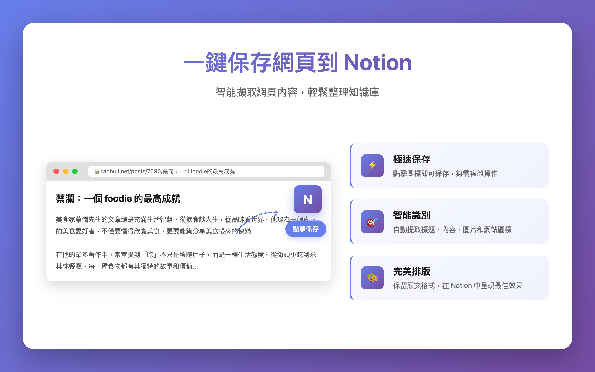
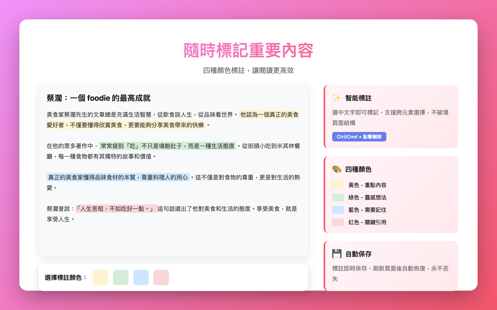
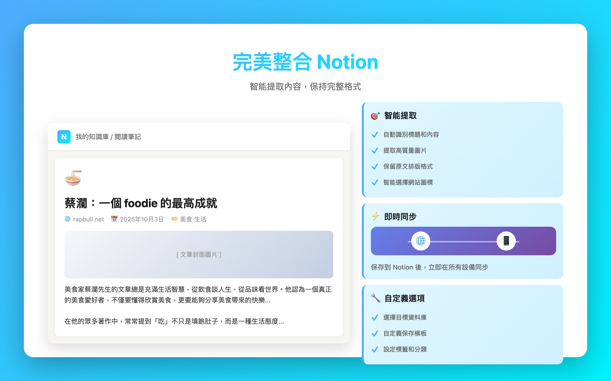
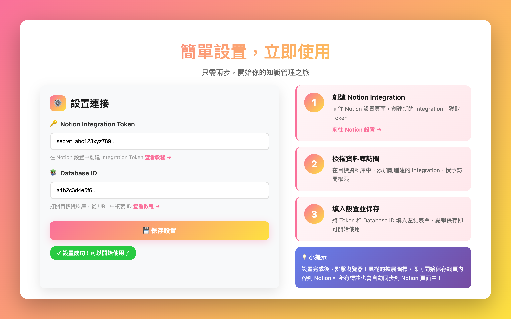
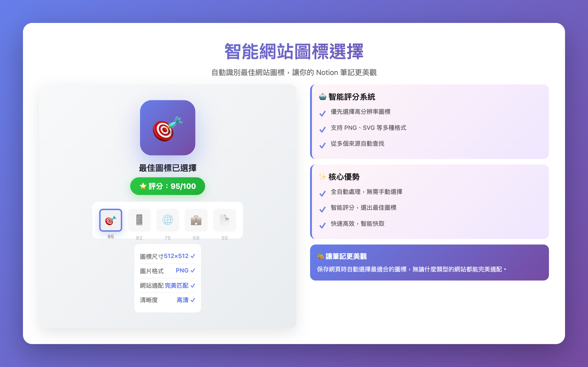

# Notion Smart Clipper v2.7.3

一個智能的 Chrome 擴展，用於將網頁內容保存到 Notion。**v2.7.3 最新版本**：🐛 修復超長文章內容截斷問題，支持完整保存任意長度的文章！

## 🎬 功能展示

<div align="center">

### 一鍵保存網頁到 Notion


### 隨時標記重要內容


### 完美整合 Notion


### 簡單設置，立即使用


### 智能網站圖標選擇


</div>

---

## ✨ 核心功能

### 🎨 新一代標註系統
- **CSS Highlight API**：使用瀏覽器原生功能，零 DOM 修改，完美跨元素支持
- **多顏色標註**：5 種顏色（🟡黃、🟢綠、🔵藍、🔴紅、🟣紫），適應不同使用場景
- **自動遷移**：智能遷移舊標註，自動回滾機制，確保數據安全
- **實時同步**：標記變更即時同步到 Notion 頁面
- **雙重刪除**：雙擊刪除或 Ctrl/Cmd + 點擊快速刪除

### 📄 智能內容提取
- **Mozilla Readability**：智能提取文章主要內容，支持多種 CMS 系統
- **自動過濾**：自動過濾廣告和無關內容
- **完整保存**：支持超長文章（8000+ 字），自動分批處理

### 🖼️ 圖片和圖標支持
- **網站 Icon**：自動提取網站 favicon/logo 顯示在 Notion 頁面標題旁
- **封面圖識別**：自動識別文章封面圖（支持 20+ 種選擇器）
- **智能過濾**：自動排除作者頭像和無關圖片
- **格式支持**：懶加載、響應式、代理 URL 自動處理

### 🎨 模板自定義
- **標題模板**：支持變量（`{title}`、`{date}`、`{domain}` 等）
- **內容選項**：可添加時間戳和來源信息
- **預覽功能**：即時查看模板效果

### ⚙️ 便捷設置
- 一鍵連接 Notion Integration
- 自動載入數據庫列表
- API Key 連接測試

---

## 📝 最新更新

### v2.7.3 (最新版本) 🐛 超長文章支持
- **修復超長文章截斷問題**：支持保存任意長度的文章（自動分批處理，遵守 Notion API 限制）
- **用戶價值**：長文章（如 8000+ 字的技術文章）現在可以完整保存，無需手動操作
- 測試案例：https://learn.g2.com/gemini-vs-chatgpt ✅

### v2.7.0-v2.7.2 主要更新
- 🎯 **圖標徽章顯示保存狀態**：擴展圖標上顯示綠色 "✓" 表示頁面已保存
- 🔗 **Open in Notion 按鈕**：保存成功後一鍵打開對應的 Notion 頁面
- 🐛 **數據清理機制**：完善數據清理，減少 90%+ 無效數據累積
- 🎨 **界面優化**：加載動畫、進度顯示、更好的視覺反饋

📚 **完整更新記錄**請查看 [CHANGELOG.md](CHANGELOG.md)

---

## 🚀 快速開始

### 1. 安裝擴展
1. 下載項目，打開 Chrome 擴展管理頁面 (`chrome://extensions/`)
2. 開啟「開發者模式」，點擊「載入未封裝項目」
3. 選擇項目文件夾

### 2. 設置 Notion Integration
1. 點擊擴展圖標 → Settings → 連接到 Notion
2. 在 Notion 創建 Integration，複製 API Token
3. 貼上 Token，選擇目標數據庫，保存設置

### 3. 授權數據庫
在 Notion 數據庫中：點擊「...」→「Add connections」→ 選擇你的 Integration

---

## 📖 使用指南

### 保存網頁
1. 瀏覽到想保存的網頁，點擊擴展圖標
2. 點擊「Save Page」，等待完成（擴展圖標會顯示綠色 "✓"）
3. 點擊「Open in Notion」可直接打開保存的頁面

### 文本標註
1. 點擊「Start Highlighting」啟用標註模式
2. 選擇標註顏色（🟡黃色、🟢綠色、🔵藍色、🔴紅色、🟣紫色）
3. 選中文字自動創建標註（支持跨段落選擇）
4. 點擊「同步」將標記保存到 Notion
5. **刪除標註**：
   - 雙擊標記文本後確認刪除
   - 或按住 Ctrl/Cmd + 點擊快速刪除

### 自定義模板
在設置頁面配置標題模板（如 `[{domain}] {title}`）和內容選項，點擊「預覽效果」查看結果

---

## 🛠️ 技術特性

- **Manifest V3**：使用最新的 Chrome 擴展標準
- **CSS Highlight API**：使用瀏覽器原生 API，零 DOM 修改
- **智能內容識別**：多層回退機制確保內容提取成功
- **圖片處理優化**：支持現代網站的各種圖片載入技術
- **模板系統**：靈活的內容自定義功能
- **錯誤處理**：完善的錯誤處理和用戶反饋

---

## 📁 項目結構

```
notion-chrome/
├── manifest.json          # 擴展配置文件
├── popup/                 # 彈出窗口
├── options/               # 設置頁面
├── scripts/               # 核心腳本
│   ├── background.js      # 後台腳本
│   ├── content.js         # 內容腳本
│   ├── highlighter-v2.js  # 新一代標註引擎
│   └── utils.js           # 工具函數
├── lib/                   # 第三方庫
│   └── Readability.js     # Mozilla Readability
└── icons/                 # 圖標文件
```

---

## 🔧 開發說明

### 主要組件
- **background.js**：處理擴展邏輯、API 調用、模板處理
- **content.js**：網頁內容提取、圖片處理
- **highlighter-v2.js**：基於 CSS Highlight API 的標註引擎
- **utils.js**：共享工具函數和 URL 處理

### 核心技術特點
- **CSS Highlight API**：使用瀏覽器原生 API，零 DOM 修改
- **URL 正規化**：移除追蹤參數（`utm_*`、`gclid`、`fbclid` 等）
- **智能遷移**：自動從舊版本升級，支持回滾機制
- **Range API**：精確的文本位置記錄和恢復

---

## 🤝 貢獻

歡迎提交 Issue 和 Pull Request 來改進這個項目！

## 🔒 隱私政策

請查看我們的 [隱私政策](PRIVACY.md) 了解更多資訊。

## 📄 許可證

MIT License
